# Smart Traffic Accident Detection System using AWS

## Overview

The Smart Traffic Accident Detection System is a cloud-based real-time monitoring solution that detects road accidents and traffic congestion from uploaded video feeds using AWS services and machine learning.

The system extracts frames from traffic videos, uploads them to AWS S3, triggers AWS Lambda functions automatically, performs accident detection using Amazon Rekognition Custom Labels, stores results in DynamoDB, and sends alerts through Amazon SNS.

---

# Features

* Real-time traffic monitoring
* Automatic frame extraction from videos
* Cloud-based serverless processing
* Custom accident detection model using Rekognition Custom Labels
* DynamoDB logging of detections
* Email alerts using SNS
* CloudWatch monitoring and logging
* Fully scalable AWS architecture

---

# AWS Services Used

1. Amazon EC2
2. Amazon S3
3. AWS Lambda
4. Amazon Rekognition Custom Labels
5. Amazon DynamoDB
6. Amazon SNS
7. Amazon CloudWatch
8. AWS IAM
9. Amazon SQS (optional alert queue integration)


---

# Folder Structure

```
smart-traffic/
│
├── detection/
│   ├── capture_and_upload.py
│   ├── upload_to_s3.py
│   ├── download_dataset.py
│   ├── traffic_feed.mp4
│   └── dataset/
│
├── lambda_detection/
│   ├── index.py
│   └── requirements.txt
│
├── alert_lambda/
│   └── receiver.py
│
└── README.md
```

---

# Setup Instructions

## 1. Launch EC2 Instance

* Create an Amazon Linux EC2 instance
* Install Python 3.9+
* Install dependencies:

```bash
sudo yum update -y
sudo yum install python3 -y
pip3 install boto3 opencv-python pillow numpy requests ddgs
```

---

## 2. Configure AWS CLI

```bash
aws configure
```

Provide:

* Access Key
* Secret Key
* Region: us-east-1

---

## 3. Create S3 Bucket

Example bucket:

```text
smart-traffic-images
```

Enable:

* S3 Event Notifications
* Trigger Lambda on ObjectCreated

---

## 4. Create Rekognition Custom Labels Model

* Upload dataset to S3
* Create project in Rekognition Custom Labels
* Train model
* Start model version

---

## 5. Create DynamoDB Table

Table Name:

```text
TrafficEvents
```

Partition Key:

```text
event_id
```

---

## 6. Create SNS Topic

Topic:

```text
AccidentAlerts
```

Subscribe email endpoint.

---

## 7. Deploy Lambda Function

Zip the Lambda code:

```bash
zip -r9 RekognitionDetectionLambda.zip .
```

Deploy:

```bash
aws lambda update-function-code \
  --function-name RekognitionDetectionLambda \
  --zip-file fileb://RekognitionDetectionLambda.zip
```

---

# Main Application Codes

---

# 1. capture_and_upload.py

```python
import cv2
import boto3
import os
import time
from datetime import datetime

BUCKET_NAME = "smart-traffic-images"
REGION = "us-east-1"
FRAME_INTERVAL = 2

s3 = boto3.client("s3", region_name=REGION)


def upload_frame(frame, frame_name):
    _, img_encoded = cv2.imencode(".jpg", frame)
    s3.put_object(
        Bucket=BUCKET_NAME,
        Key=frame_name,
        Body=img_encoded.tobytes(),
        ContentType='image/jpeg'
    )


def process_video(video_path):
    cap = cv2.VideoCapture(video_path)

    if not cap.isOpened():
        print(f"❌ Cannot open video file: {video_path}")
        return

    fps = cap.get(cv2.CAP_PROP_FPS)
    frame_skip = int(fps * FRAME_INTERVAL)

    frame_count = 0

    print(f"🎥 Capturing frames every {FRAME_INTERVAL}s from '{video_path}' and uploading to {BUCKET_NAME}...")

    while True:
        ret, frame = cap.read()

        if not ret:
            break

        if frame_count % frame_skip == 0:
            timestamp = datetime.utcnow().strftime("%Y%m%d_%H%M%S")
            frame_name = f"frame_{timestamp}.jpg"

            upload_frame(frame, frame_name)
            print(f"✅ Uploaded {frame_name} to {BUCKET_NAME}")

        frame_count += 1

    cap.release()
    print("🏁 Capture and upload process finished.")


if __name__ == "__main__":
    import sys

    if len(sys.argv) < 2:
        print("Usage: python3 capture_and_upload.py <video_file>")
    else:
        process_video(sys.argv[1])
```

---

# 2. download_dataset.py

```python
import os
import requests
from PIL import Image, ImageStat
from io import BytesIO
from ddgs import DDGS
import time
import numpy as np

DATASET_DIR = "dataset"

CATEGORIES = {
    "accident": [
        "car accident on road",
        "vehicle crash on highway",
        "traffic collision"
    ],
    "traffic": [
        "traffic jam road",
        "busy city traffic",
        "vehicle congestion"
    ],
    "normal": [
        "empty highway",
        "clear road",
        "normal road traffic"
    ]
}


def download_images(search_term, folder, max_results=20):
    os.makedirs(folder, exist_ok=True)

    with DDGS() as ddgs:
        results = ddgs.images(query=search_term, max_results=max_results)

        for i, result in enumerate(results):
            try:
                url = result["image"]
                response = requests.get(url, timeout=10)
                img = Image.open(BytesIO(response.content)).convert("RGB")
                img.save(f"{folder}/{search_term.replace(' ', '_')}_{i}.jpg")
                print(f"✅ Saved image {i}")
            except Exception as e:
                print(f"⚠️ Error: {e}")


for category, queries in CATEGORIES.items():
    for query in queries:
        download_images(query, os.path.join(DATASET_DIR, category), 20)
        time.sleep(10)
```

---

# 3. upload_to_s3.py

```python
import boto3
import os

BUCKET_NAME = "smart-traffic-images"
REGION = "us-east-1"
DATASET_PATH = "dataset"

s3 = boto3.client("s3", region_name=REGION)


def upload_folder(path, bucket):
    for root, dirs, files in os.walk(path):
        for file in files:
            local_path = os.path.join(root, file)
            s3_key = os.path.relpath(local_path, path)

            try:
                s3.upload_file(local_path, bucket, s3_key)
                print(f"✅ Uploaded {s3_key}")
            except Exception as e:
                print(f"❌ Error: {e}")


upload_folder(DATASET_PATH, BUCKET_NAME)
```

---

# 4. RekognitionDetectionLambda (index.py)

```python
import json
import boto3
import os
from datetime import datetime

rekognition = boto3.client('rekognition')
dynamodb = boto3.resource('dynamodb')
sns = boto3.client('sns')

TABLE_NAME = os.environ['TABLE_NAME']
SNS_TOPIC_ARN = os.environ['SNS_TOPIC_ARN']
MODEL_ARN = os.environ['MODEL_ARN']


def lambda_handler(event, context):
    table = dynamodb.Table(TABLE_NAME)

    for record in event['Records']:
        bucket = record['s3']['bucket']['name']
        key = record['s3']['object']['key']

        print(f"📸 New upload detected: {bucket}/{key}")

        try:
            response = rekognition.detect_custom_labels(
                ProjectVersionArn=MODEL_ARN,
                Image={'S3Object': {'Bucket': bucket, 'Name': key}},
                MinConfidence=70
            )

            labels = [label['Name'] for label in response['CustomLabels']]
            print(f"🧠 Labels: {labels}")

            event_type = "normal"
            severity = "low"

            if any(l.lower() in ["accident", "crash", "collision"] for l in labels):
                event_type = "accident"
                severity = "high"

            event_data = {
                "event_id": key,
                "timestamp": datetime.utcnow().isoformat(),
                "type": event_type,
                "severity": severity,
                "labels": labels
            }

            table.put_item(Item=event_data)
            print("✅ Saved to DynamoDB")

            if event_type != "normal":
                sns.publish(
                    TopicArn=SNS_TOPIC_ARN,
                    Subject="🚨 Accident Detected",
                    Message=json.dumps(event_data, indent=2)
                )
                print("📧 SNS alert sent")

        except Exception as e:
            print("⚠️ Error:", e)

    return {
        "statusCode": 200,
        "body": "Processed successfully"
    }
```

---

# 5. receiver.py

```python
import json


def lambda_handler(event, context):
    for record in event['Records']:
        message = record['Sns']['Message']
        print(f"📩 Received Alert: {message}")

    return {
        'statusCode': 200,
        'body': json.dumps('Alert received')
    }
```

---

# Running the Project

## Start Rekognition Model

```bash
aws rekognition start-project-version \
  --project-version-arn <MODEL_ARN> \
  --min-inference-units 1
```

---

## Upload and Process Video

```bash
python3 capture_and_upload.py traffic_feed.mp4
```

---

## Monitor Logs

```bash
aws logs tail /aws/lambda/RekognitionDetectionLambda --follow --region us-east-1
```

---

## Stop Rekognition Model

```bash
aws rekognition stop-project-version \
  --project-version-arn <MODEL_ARN>
```

---
# Screenshots

## AWS Architecture
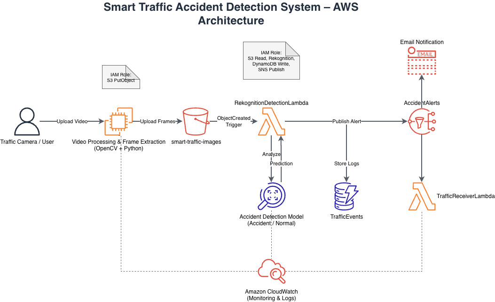

---

## EC2 Video Processing
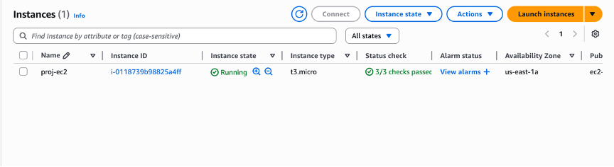

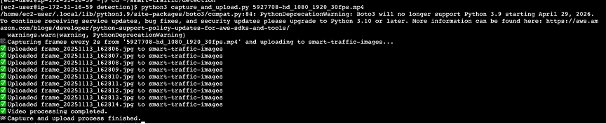

---

## Amazon S3 Bucket
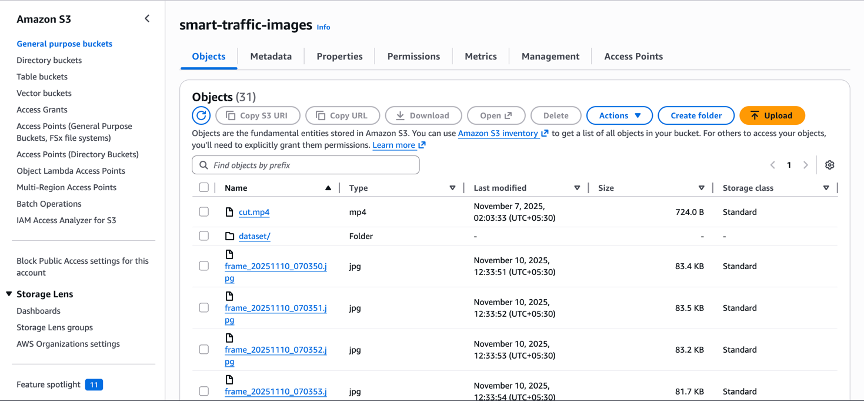

---

## Rekognition Custom Labels
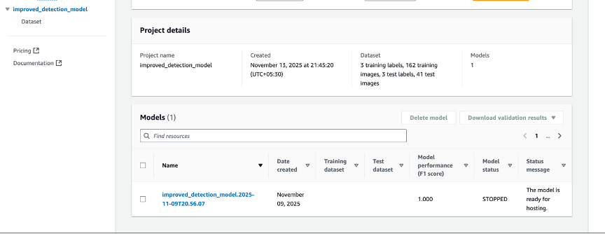

---

## Lambda Function
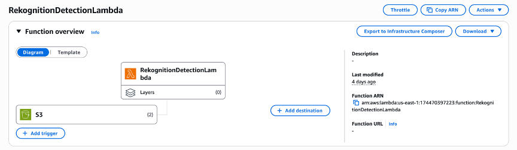

---

## DynamoDB Logging
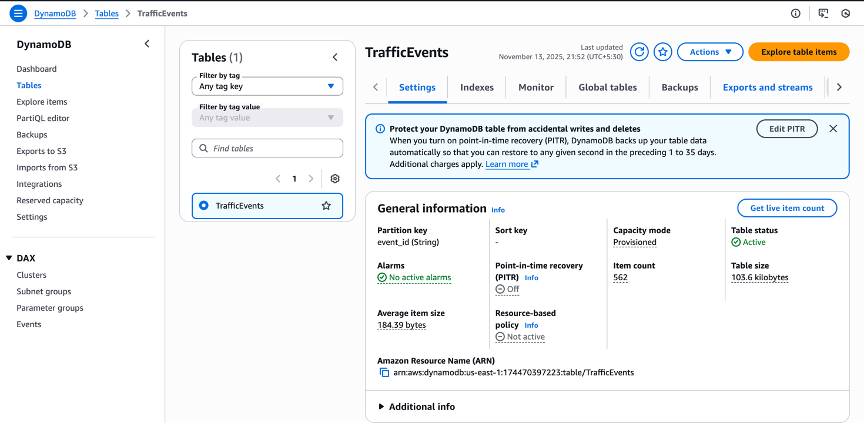

---

## SNS Alerts
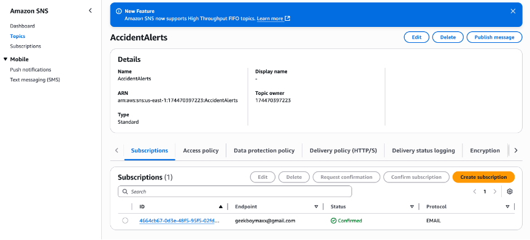

---

## Alert Receiver Lambda
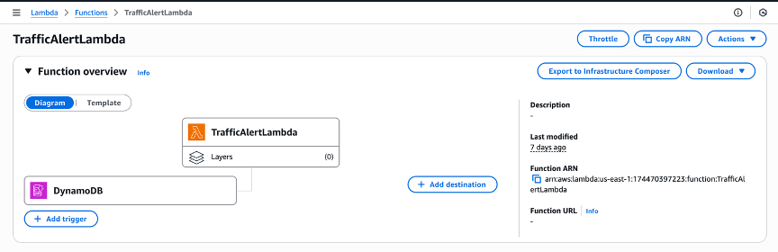

---

## Accident Alert Email
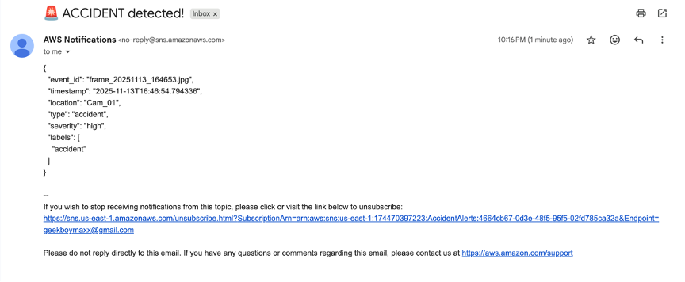

---

## Traffic Alert Email
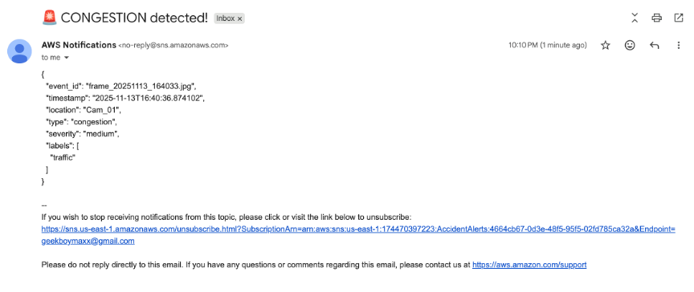

---

## CloudWatch Logs
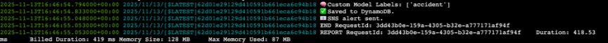

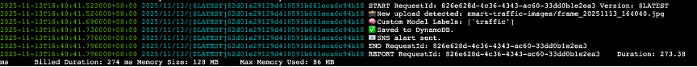

---

## Dataset Preview
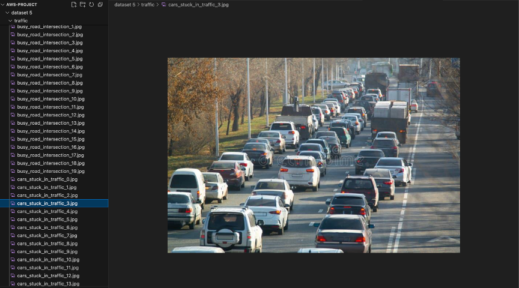

---

## Model Performance
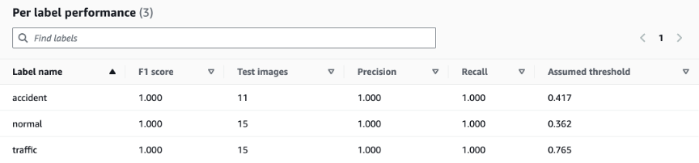

# Future Improvements

* Live CCTV streaming
* Multi-camera support
* AI-based congestion prediction
* Mobile application integration
* Dashboard using AWS QuickSight
* Emergency dispatch integration

---

# Authors

Team Name: TrafficVision AI

Members:

* Sreesh Jambulingam
* Rishabh Karjee
* Bhargav Sargunesan Venkatesh

---

# References

* AWS Documentation
* OpenCV Documentation
* Boto3 SDK Documentation
* Amazon Rekognition Developer Guide
* AWS Lambda Developer Guide
